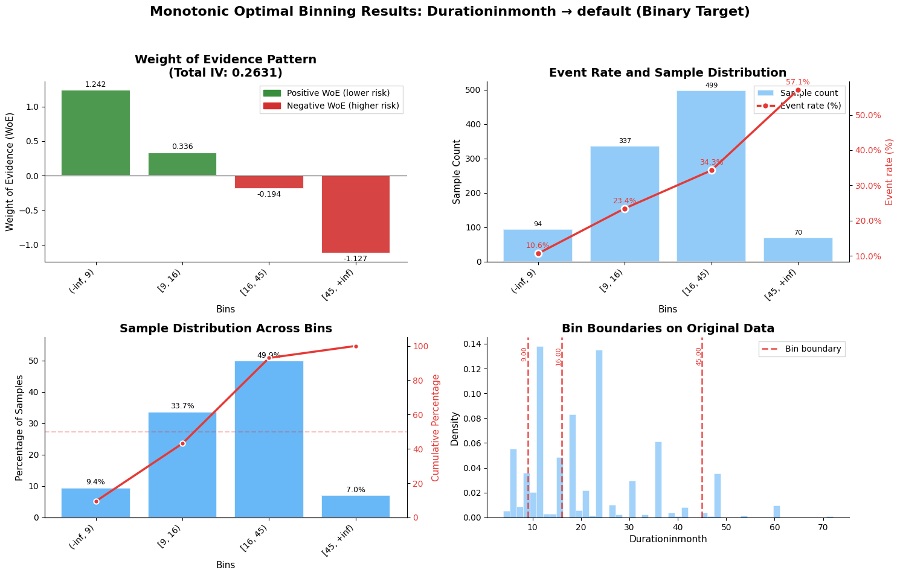
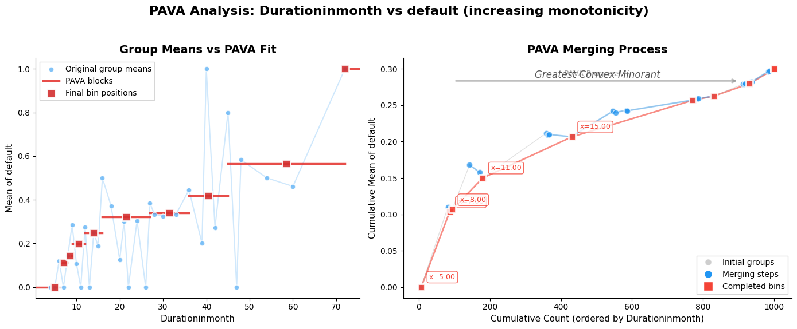

<h1><p align="center"><strong>Monotonic-Optimal-Binning</strong></p></h1>

<h2><p align="center">MOBPY - Monotonic Optimal Binning for Python</p></h2>

[](https://github.com/ChenTaHung/Monotonic-Optimal-Binning/actions/workflows/RunTests.yml)
[](https://www.python.org/downloads/)
[](https://opensource.org/licenses/MIT)
[](https://badge.fury.io/py/mobpy)

A fast, deterministic Python library for creating **monotonic optimal bins** with respect to a target variable. MOBPY implements a stack-based Pool-Adjacent-Violators Algorithm (PAVA) followed by constrained adjacent merging, ensuring strict monotonicity and statistical robustness.

## 🎯 Key Features

- **⚡ Fast & Deterministic**: Stack-based PAVA with O(n) complexity, followed by O(k) adjacent merges
- **📊 Monotonic Guarantee**: Ensures strict monotonicity (increasing/decreasing) between bins and target
- **🔧 Flexible Constraints**: Min/max samples, min positives, min/max bins with automatic resolution
- **📈 WoE & IV Calculation**: Automatic Weight of Evidence and Information Value for binary targets
- **🎨 Rich Visualizations**: Comprehensive plotting functions for PAVA process and binning results
- **♾️ Safe Edges**: First bin starts at -∞, last bin ends at +∞ for complete coverage

## 📦 Installation

```bash
pip install MOBPY
```

For development installation:
```bash
git clone https://github.com/ChenTaHung/Monotonic-Optimal-Binning.git
cd Monotonic-Optimal-Binning
pip install -e .
```

## 🚀 Quick Start

```python
import pandas as pd
import numpy as np
from MOBPY import MonotonicBinner, BinningConstraints
from MOBPY.plot import plot_bin_statistics, plot_pava_comparison
import matplotlib.pyplot as plt

df = pd.read_csv('/Users/chentahung/Desktop/git/mob-py/data/german_data_credit_cat.csv')
# Convert default to 0/1 (original is 1/2)
df['default'] = df['default'] - 1

# Configure constraints
constraints = BinningConstraints(
    min_bins=4,           # Minimum number of bins
    max_bins=6,           # Maximum number of bins
    min_samples=0.05,     # Each bin needs at least 5% of total samples
    min_positives=0.01    # Each bin needs at least 1% of total positive samples
)

# Create and fit the binner
binner = MonotonicBinner(
    df=df,
    x='Durationinmonth',
    y='default',
    constraints=constraints
)
binner.fit()

# Get binning results
bins = binner.bins_()        # Bin boundaries
summary = binner.summary_()  # Detailed statistics with WoE/IV
display(summary)
```

Output:
```
    bucket	    count	count_pct	sum	    mean	    std	        min	 max	woe	        iv
0	(-inf, 9)	94	    9.4	        10.0	0.106383	0.309980	0.0	 1.0	1.241870	0.106307
1	[9, 16)	    337	    33.7	    79.0	0.234421	0.424267	0.0	 1.0	0.335632	0.035238
2	[16, 45)	499	    49.9	    171.0	0.342685	0.475084	0.0	 1.0	-0.193553	0.019342
3	[45, +inf)	70	    7.0	4       0.0	    0.571429	0.498445	0.0	 1.0	-1.127082	0.102180
```

## 📊 Visualization

MOBPY provides comprehensive visualization of binning results:

```python
# Generate comprehensive binning analysis plot
fig = plot_bin_statistics(binner)
plt.show()
```



*The `plot_bin_statistics` function creates a multi-panel visualization showing:*
- **Top Left**: Weight of Evidence (WoE) bars for each bin
- **Top Right**: Event rate trend with sample distribution
- **Bottom Left**: Sample distribution histogram
- **Bottom Right**: Target distribution boxplots per bin

## 🔬 Understanding the Algorithm

MOBPY uses a two-stage approach:

### Stage 1: PAVA (Pool-Adjacent-Violators Algorithm)
Creates initial monotonic blocks by pooling adjacent violators:

```python
from MOBPY.plot import plot_pava_comparison

# Visualize PAVA process
fig = plot_pava_comparison(binner)
plt.show()
```



### Stage 2: Constrained Merging
Merges adjacent blocks to satisfy constraints while preserving monotonicity:

```python
# Check initial PAVA blocks vs final bins
print(f"PAVA blocks: {len(binner.pava_blocks_())}")
print(f"Final bins: {len(binner.bins_())}")

> PAVA blocks: 10
> Final bins: 4
```

## 🎛️ Advanced Configuration

### Custom Constraints

```python
# Fractional constraints (adaptive to data size)
constraints = BinningConstraints(
    max_bins=8,
    min_samples=0.05,     # 5% of total samples
    max_samples=0.30,     # 30% of total samples
    min_positives=0.01    # 1% of positive samples
)

# Absolute constraints (fixed values)
constraints = BinningConstraints(
    max_bins=5,
    min_samples=100,      # At least 100 samples per bin
    max_samples=500       # At most 500 samples per bin
)
```

### Handling Special Values

```python
# Exclude special codes from binning
age_binner = MonotonicBinner(
    df=df,
    x='Age',
    y='default',
    constraints= constraints,
    exclude_values=[-999, -1, 0]  # Treat as separate bins
).fit()
```

### Transform New Data

```python
new_data = pd.DataFrame({'age': [25, 45, 65]})

# Get bin assignments
bins = age_binner.transform(new_data['age'], assign='interval')
print(bins)
# Output:
# 0    (-inf, 26)
# 1      [35, 75)
# 2      [35, 75)
# Name: age, dtype: object

# Get WoE values for scoring
print(age_binner.transform(new_data['age'], assign='woe'))
# Output:
# 0   -0.526748
# 1    0.306015
# 2    0.306015
```

## 📈 Use Cases

MOBPY is ideal for:

- **Credit Risk Modeling**: Create monotonic risk score bins for regulatory compliance
- **Insurance Pricing**: Develop age/risk factor bands with clear premium progression
- **Customer Segmentation**: Build ordered customer value tiers
- **Feature Engineering**: Generate interpretable binned features for ML models
- **Regulatory Reporting**: Ensure transparent, monotonic relationships in models

## 🔧 Performance

MOBPY is optimized for production use:

- **Time Complexity**: O(n log n) for sorting + O(n) for PAVA + O(k²) for merging
- **Space Complexity**: O(n) for data storage
- **Scalability**: Handles datasets from 10² to 10⁶ samples efficiently

Benchmark on 1M samples, 20 final bins:
- Data preparation: 0.3s
- PAVA fitting: 0.8s
- Constraint merging: 0.2s
- **Total time: ~1.3s**

## 📚 Documentation

- [API Reference](docs/api_reference.md) - Complete API documentation
- [Algorithm Details](docs/core) - Mathematical foundations
- [Examples](examples/) - Jupyter notebooks with real-world examples

## 🧪 Testing

```bash
# Run unit tests
pytest -vv -ignore-userwarnings -q
```

## 📖 Reference

* [Mironchyk, Pavel, and Viktor Tchistiakov. *Monotone optimal binning algorithm for credit risk modeling.* (2017)](https://www.researchgate.net/profile/Viktor-Tchistiakov/publication/322520135_Monotone_optimal_binning_algorithm_for_credit_risk_modeling/links/5a5dd1a8458515c03edf9a97/Monotone-optimal-binning-algorithm-for-credit-risk-modeling.pdf)
* [Smalbil, P. J. *The choices of weights in the iterative convex minorant algorithm.* (2015)](https://repository.tudelft.nl/islandora/object/uuid:5a111157-1a92-4176-9c8e-0b848feb7c30)
* Testing Dataset 1: [German Credit Risk](https://www.kaggle.com/datasets/uciml/german-credit) from Kaggle
* Testing Dataset 2: [US Health Insurance Dataset](https://www.kaggle.com/datasets/teertha/ushealthinsurancedataset) from Kaggle
* GitHub Project: [Monotone Optimal Binning (SAS 9.4 version)](https://github.com/cdfq384903/MonotonicOptimalBinning)

## 👥 Authors

1. Ta-Hung (Denny) Chen
   * LinkedIn: [https://www.linkedin.com/in/dennychen-tahung/](https://www.linkedin.com/in/dennychen-tahung/)
   * E-mail: [denny20700@gmail.com](mailto:denny20700@gmail.com)

2. Yu-Cheng (Darren) Tsai
   * LinkedIn: [https://www.linkedin.com/in/darren-yucheng-tsai/](https://www.linkedin.com/in/darren-yucheng-tsai/)
   * E-mail:

3. Peter Chen
   * LinkedIn: [https://www.linkedin.com/in/peterchentsungwei/](https://www.linkedin.com/in/peterchentsungwei/)
   * E-mail: [peterwei20700@gmail.com](mailto:peterwei20700@gmail.com)

## 📄 License

This project is licensed under the MIT License - see the [LICENSE](LICENSE) file for details.

## 🤝 Contributing

Contributions are welcome! Please feel free to submit a Pull Request. For major changes, please open an issue first to discuss what you would like to change.