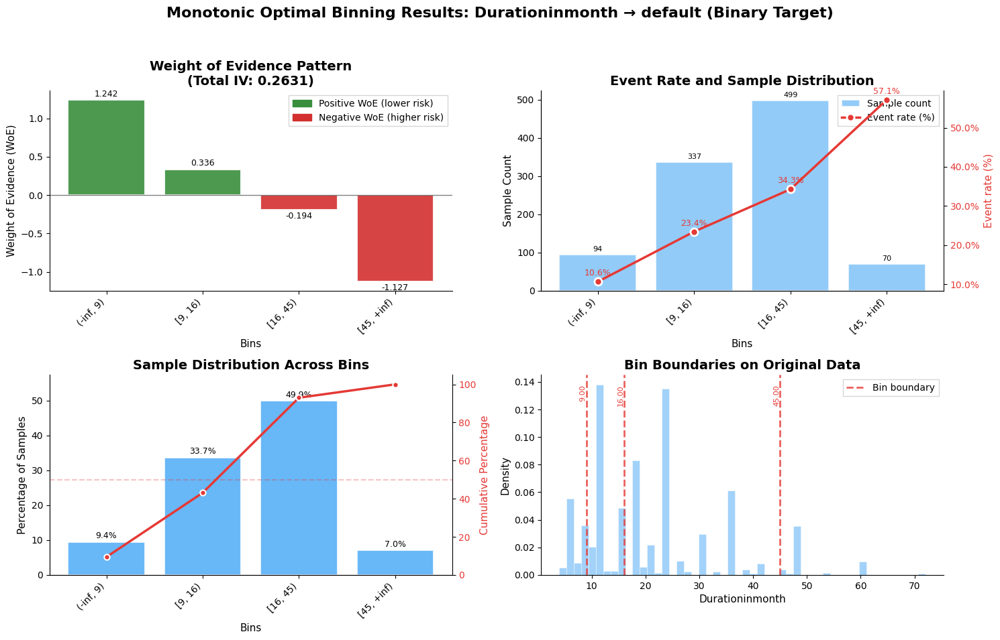
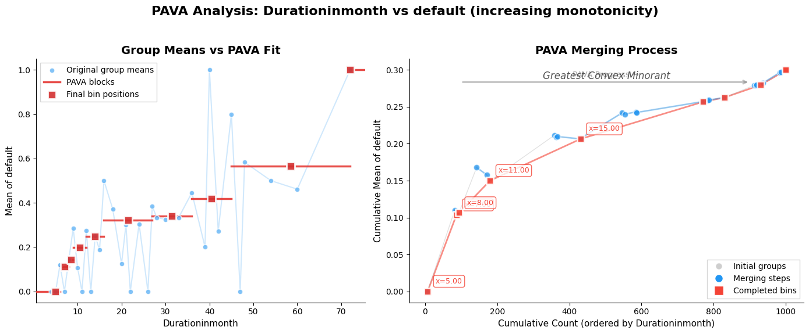
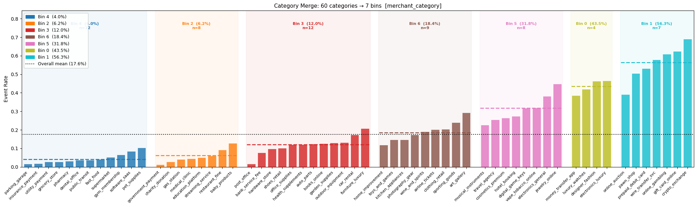

<h1><p align="center"><strong>Monotonic-Optimal-Binning</strong></p></h1>

<h2><p align="center">MOBPY - Monotonic Optimal Binning for Python</p></h2>

[](https://github.com/ChenTaHung/Monotonic-Optimal-Binning/actions/workflows/RunTests.yml)
[](https://www.python.org/downloads/)
[](https://opensource.org/licenses/MIT)
[](https://pypi.org/project/MOBPY/)

A fast, deterministic Python library for creating **monotonic optimal bins** with respect to a target variable. MOBPY implements two distinct binning pipelines:

- **Numeric x** — stack-based PAVA + constrained adjacent merging (Welch's t-test)
- **Categorical x** — chi-square merging with multiple comparison correction (Holm by default)

## 🎯 Key Features

- **⚡ Fast & Deterministic**: O(n log n) + O(n) PAVA for numeric; O(k²) chi-square merging for categorical
- **🔀 Two Binning Paths**: Numeric PAVA pipeline and categorical chi-square pipeline — unified API
- **📊 Monotonic Guarantee**: Strict monotonicity between bins and target (numeric path)
- **🔧 Flexible Constraints**: Min/max samples, min positives, min negatives, min/max bins — enforced on both paths
- **📈 WoE & IV Calculation**: Automatic Weight of Evidence and Information Value for binary targets (all bins including Missing and Excluded)
- **🎨 Rich Visualizations**: PAVA process plots, WoE bars, event rate charts, and `plot_categorical_merge` for the categorical path
- **♾️ Safe Edges**: First bin at -∞, last at +∞ for numeric; full category-set coverage for categorical

## 📦 Installation

```bash
pip install MOBPY
```

For development installation:

```bash
git clone https://github.com/ChenTaHung/Monotonic-Optimal-Binning.git
cd Monotonic-Optimal-Binning
pip install -e .
```

## 🚀 Quick Start

### Numeric Binning

```python
import pandas as pd
from MOBPY import MonotonicBinner, BinningConstraints
from MOBPY.plot import plot_bin_statistics
import matplotlib.pyplot as plt

df = pd.read_csv('data/german_data_credit_cat.csv')
df['default'] = df['default'] - 1  # convert 1/2 → 0/1

constraints = BinningConstraints(
    min_bins=4,
    max_bins=6,
    min_samples=0.05,     # at least 5% of total samples per bin
    min_positives=0.01,   # at least 1% of positives per bin
    min_negatives=0.01,   # at least 1% of negatives per bin (ensures stable WoE)
)

binner = MonotonicBinner(df=df, x='Durationinmonth', y='default',
                         constraints=constraints)
binner.fit()

summary = binner.summary_()
print(summary[['bucket', 'count', 'mean', 'woe', 'iv']])
```

Output:

```
    bucket      count  mean      woe         iv
0  (-inf, 9)      94  0.106  1.241870  0.106307
1  [9, 16)       337  0.234  0.335632  0.035238
2  [16, 45)      499  0.343 -0.193553  0.019342
3  [45, +inf)     70  0.571 -1.127082  0.102180
```

### Categorical Binning

```python
import pandas as pd
from MOBPY import MonotonicBinner, BinningConstraints
from MOBPY.plot import plot_woe_bars, plot_categorical_merge
import matplotlib.pyplot as plt

df = pd.read_csv('data/transactions.csv')

binner = MonotonicBinner(
    df=df,
    x='merchant_category',
    y='is_fraud',
    x_type='categorical',          # activate chi-square merging
    categorical_alpha=0.05,
    categorical_correction='holm',
    constraints=BinningConstraints(max_bins=8, min_bins=2, min_samples=30),
    max_label_cats=3,              # truncate long bin labels: {A, B, C, ...+N}
)
binner.fit()

diag = binner.get_diagnostics()
print(f"{diag['n_initial_categories']} categories → {diag['n_final_bins']} bins")
print(f"Total IV: {binner.summary_()['iv'].sum():.4f}")

# Visualize
fig, axes = plt.subplots(1, 2, figsize=(18, 5))
plot_woe_bars(binner.summary_(), ax=axes[0], tick_labels='auto', show_iv=True)
plot_categorical_merge(binner, ax=axes[1], show_counts=False)
plt.tight_layout()
plt.show()

# Category → bin mapping
ba = binner.bin_assignment()
for bin_idx in sorted(ba.unique()):
    print(f"Bin {bin_idx} ({binner.bins_().loc[bin_idx, 'mean']:.1%}):",
          sorted(ba[ba == bin_idx].index))
```

## 📊 Visualization

### Numeric binning — comprehensive analysis

```python
from MOBPY.plot import plot_bin_statistics

fig = plot_bin_statistics(binner)
plt.show()
```



*`plot_bin_statistics` creates a multi-panel view: WoE bars · event rate · sample distribution · bin boundaries on data.*

### Numeric binning — PAVA process

```python
from MOBPY.plot import plot_pava_comparison

fig = plot_pava_comparison(binner)
plt.show()
```



### Categorical binning — merge visualization

```python
from MOBPY import MonotonicBinner, BinningConstraints
from MOBPY.plot import plot_categorical_merge
import matplotlib.pyplot as plt

binner = MonotonicBinner(
    # Please refer to examples/E-Commerce Fraud - Categorical Binning.ipynb
)
binner.fit()

fig, ax = plt.subplots(figsize=(20, 6))
plot_categorical_merge(
    binner,
    ax=ax,
    show_counts=False,   # 60 bars — skip per-bar counts to avoid clutter
)
plt.tight_layout()
plt.show()
```



*`plot_categorical_merge` shows each original category as a bar, coloured by its final bin. Groups are separated by gaps; a dashed line spans each bin at its pooled event rate; the dotted line marks the overall mean.*

## 🔬 Understanding the Algorithm

### Numeric path (x_type='numeric', default)

**Stage 1 — PAVA**: Creates initial monotonic blocks by pooling adjacent violators.

**Stage 2 — Constrained merging**: Merges adjacent blocks (3 phases):

1. Statistical merging (Welch's t-test, respects `max_bins`)
2. `min_samples` enforcement (stop at `min_bins` floor)
3. `min_positives` / `min_negatives` enforcement (binary targets only)

```python
print(f"PAVA blocks: {len(binner.pava_blocks_())}")
print(f"Final bins:  {len(binner.bins_())}")
# PAVA blocks: 10
# Final bins:  4
```

### Categorical path (x_type='categorical')

**Stage 1 — Chi-square merging**: Pairs of category blocks are merged based on adjusted p-values (3 phases):

1. Statistical merging — chi-square + Holm correction, pair-result cache keeps total cost O(k²)
2. `min_samples` enforcement
3. `min_positives` / `min_negatives` enforcement

## 🎛️ Advanced Configuration

### Constraints with class-count enforcement

```python
# Fractional (adaptive to data size)
constraints = BinningConstraints(
    max_bins=8,
    min_samples=0.05,     # 5% of total samples
    max_samples=0.30,     # 30% of total samples
    min_positives=0.02,   # 2% of positive samples
    min_negatives=0.02,   # 2% of negative samples — prevents log(0) in WoE
)

# Absolute (fixed)
constraints = BinningConstraints(
    max_bins=5,
    min_samples=100,
    min_positives=20,
    min_negatives=50,
)
```

### Handling special values

```python
age_binner = MonotonicBinner(
    df=df,
    x='Age',
    y='default',
    constraints=constraints,
    exclude_values=[-999, -1, 0],   # reported as separate rows in summary_()
).fit()
```

### Unseen categories (categorical path)

```python
binner = MonotonicBinner(
    df=train_df, x='category', y='target',
    x_type='categorical',
    unseen_categories='error',     # raises ValueError for unseen values (default)
    # unseen_categories='unknown', # returns "Unknown" / NaN WoE instead
)
binner.fit()

# Transform test data — unseen categories handled gracefully
df['bin'] = binner.transform(test_df['category'], assign='interval')
df['woe'] = binner.transform(test_df['category'], assign='woe')
```

### Transform new data

```python
new_data = pd.DataFrame({'age': [25, 45, 65]})

# Bin label
print(binner.transform(new_data['age'], assign='interval'))
# 0    (-inf, 26)
# 1      [35, 75)
# 2      [35, 75)

# WoE score
print(binner.transform(new_data['age'], assign='woe'))
# 0   -0.526748
# 1    0.306015
# 2    0.306015
```

## 📈 Use Cases

MOBPY is ideal for:

- **Credit Risk Modeling**: Create monotonic risk score bins for regulatory compliance
- **Insurance Pricing**: Develop age/risk factor bands with clear premium progression
- **Customer Segmentation**: Build ordered customer value tiers or merge categorical merchant types
- **Feature Engineering**: Generate interpretable binned features for scorecards
- **Regulatory Reporting**: Ensure transparent, monotonic relationships in models

## 📚 Documentation

- [API Reference](docs/api_reference.md) — Project structure and workflow
- [MonotonicBinner](docs/binning/mob.md) — Full class API (numeric + categorical)
- [BinningConstraints](docs/core/constraints.md) — Constraint configuration
- [Categorical Merge Module](docs/core/categorical_merge.md) — Chi-square algorithm details
- [Plot Module](docs/plot/init.md) — All visualization functions
- [plot_categorical_merge](docs/plot/mob_plot/plot_categorical_merge.md) — Categorical merge visualization
- [Examples & Tutorials](examples/) — Jupyter notebooks with real-world examples

## 🧪 Testing

```bash
# Run all tests
.venv/bin/python -m pytest tests/ -q
```

## 📖 Reference

* [Mironchyk, Pavel, and Viktor Tchistiakov. *Monotone optimal binning algorithm for credit risk modeling.* (2017)](https://www.researchgate.net/profile/Viktor-Tchistiakov/publication/322520135_Monotone_optimal_binning_algorithm_for_credit_risk_modeling/links/5a5dd1a8458515c03edf9a97/Monotone-optimal-binning-algorithm-for-credit-risk-modeling.pdf)
* [Smalbil, P. J. *The choices of weights in the iterative convex minorant algorithm.* (2015)](https://repository.tudelft.nl/islandora/object/uuid:5a111157-1a92-4176-9c8e-0b848feb7c30)
* Testing Dataset 1: [German Credit Risk](https://www.kaggle.com/datasets/uciml/german-credit) from Kaggle
* Testing Dataset 2: [US Health Insurance Dataset](https://www.kaggle.com/datasets/teertha/ushealthinsurancedataset) from Kaggle
* GitHub Project: [Monotone Optimal Binning (SAS 9.4 version)](https://github.com/cdfq384903/MonotonicOptimalBinning)

## 👥 Authors

1. Ta-Hung (Denny) Chen
   * LinkedIn: [https://www.linkedin.com/in/dennychen-tahung/](https://www.linkedin.com/in/dennychen-tahung/)
   * E-mail: [denny20700@gmail.com](mailto:denny20700@gmail.com)

2. Yu-Cheng (Darren) Tsai
   * LinkedIn: [https://www.linkedin.com/in/darren-yucheng-tsai/](https://www.linkedin.com/in/darren-yucheng-tsai/)

3. Peter Chen
   * LinkedIn: [https://www.linkedin.com/in/peterchentsungwei/](https://www.linkedin.com/in/peterchentsungwei/)
   * E-mail: [peterwei20700@gmail.com](mailto:peterwei20700@gmail.com)

## 📄 License

This project is licensed under the MIT License - see the [LICENSE](LICENSE) file for details.

## 🤝 Contributing

Contributions are welcome! Please feel free to submit a Pull Request. For major changes, please open an issue first to discuss what you would like to change.
